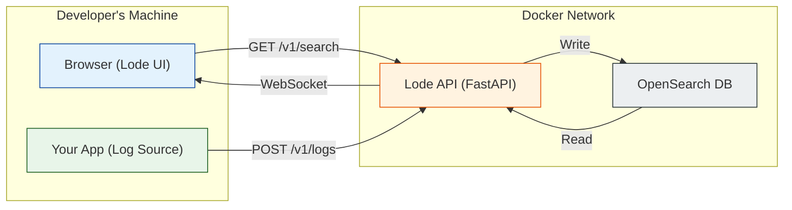

<p align="center">
  
</p>

<h1 align="center">Lode</h1>

<p align="center">
  <strong>An opinionated, developer-first log viewer for the local development lifecycle.</strong>
  <br />
  Designed for solo developers and small projects where enterprise tools are overkill.
</p>

<p align="center">
  <a href="#-key-features">Key Features</a> •
  <a href="#-architecture">Architecture</a> •
  <a href="#-repositories">Repositories</a> •
  <a href="#-getting-started">Getting Started</a>
</p>

-----

**Lode's entire philosophy is 'zero-to-insight in under 5 minutes'—a single command to launch, no complex setup, and an interactive UI that prioritizes clarity over complexity.** It's the precision screwdriver for a developer's local workbench, not the sledgehammer for enterprise-wide data collection.

## ✨ Key Features

* **Minimal Setup:** Launch the entire stack with a single `docker-compose up` command.
* **Real-Time Tailing:** See logs appear instantly with a WebSocket-powered "Live Tail."
* **Powerful Filtering & Search:** An intelligent autocomplete bar for specific field filtering (`level:error`) and a robust full-text search (`q=...`).
* **Interactive UI:** Go beyond plain text with expandable "Developer Context Cards" that make exploring metadata and filtering by `trace_id` or `user_id` effortless.
* **Intelligent Suggestions:** Proactively suggests common fields to filter by, based on an analysis of your entire dataset.

## 🛠️ Tech Stack

<p align="center">
  
  
  
  
  
  
  
</p>

## 🏗️ Architecture

Lode is built using a multi-repository, microservice-oriented approach. The entire stack is containerized and orchestrated with Docker Compose for a seamless local development experience.



## 📚 Repositories

This organization contains all the components that make up the Lode platform.

| Repository                                     | Description                                                                 |
| ---------------------------------------------- | --------------------------------------------------------------------------- |
| 🚀 [**lode-deployment**](./lode-deployment)     | The command center. Contains the `docker-compose.yml` to launch the stack.    |
| 🧠 [**lode-api**](./lode-api)                   | The FastAPI backend for ingestion, querying, aggregations, and WebSockets.  |
| 🎨 [**lode-ui**](./lode-ui)                     | The interactive React frontend for viewing and analyzing logs.                |
| 📦 [**lode-logger**](./lode-logger)             | A lightweight Python client library for easy log shipping.                  |

## 🚀 Getting Started

Ready to run Lode on your machine?

1.  **Clone the deployment repository:**

    ```bash
    git clone [https://github.com/lode-dev/lode-deployment.git](https://github.com/lode-dev/lode-deployment.git)
    cd lode-deployment
    ```

2.  **Launch the stack:**

    ```bash
    docker-compose up --build
    ```

3.  **You're live\!**

      * **Lode UI:** [http://localhost:5173](http://localhost:5173)
      * **Lode API Docs:** [http://localhost:8000/docs](http://localhost:8000/docs)
