<p align="center">
  
</p>

<h1 align="center">Lode - The AI Log Assistant</h1>

<p align="center">
  <strong>An opinionated, developer-first AI log assistant for the local development lifecycle.</strong>
  <br />
  Designed for solo developers and small projects where enterprise tools are overkill.
</p>

<p align="center">
  <a href="#key-features">Key Features</a> •
  <a href="#architecture">Architecture</a> •
  <a href="#repositories">Repositories</a> •
  <a href="#getting-started">Getting Started</a>
</p>

---

**Lode's entire philosophy is 'zero-to-insight in under 5 minutes'—a single command to launch, no complex setup, and an interactive UI that prioritizes clarity over complexity.** It's the precision screwdriver for a developer's local workbench, not the sledgehammer for enterprise-wide data collection.

## ✨ Key Features

* **Conversational AI Assistant:** Chat with your logs. Ask questions in natural language ("summarize the errors from the last hour") and get **streaming responses** from a local LLM to accelerate debugging.
* **Minimal Setup:** Launch the entire multi-container stack (API, UI, databases, cache, LLM) with a single `docker-compose up` command.
* **Real-Time Tailing:** See raw logs appear instantly with a WebSocket-powered "Live Tail."
* **Powerful Filtering & Search:** An intelligent autocomplete bar for specific field filtering (`level:error`) and robust full-text search.
* **Performance Caching:** Integrates **Redis** to cache expensive queries and aggregation results, ensuring a snappy user experience.
* **Drop-in Python Logger:** Includes the `lode-logger`, a lightweight client designed as a simple replacement for Python's standard logging module.

## 🛠️ Tech Stack

<p align="center">
  
  
  
  
  
  
  
  
  
</p>

---

## 🏗️ Architecture

Lode uses a multi-repository, microservice-oriented architecture. It demonstrates proficiency with both NoSQL and SQL databases, caching layers, and interaction with a local LLM.

```mermaid
graph TB
    subgraph DEV["👩‍💻 Developer's Machine"]
        direction TB
        A["🌐 Browser<br/><small>Lode UI</small>"]
        B["📦 Your Application<br/><small>Log Source</small>"]
    end
    
    subgraph DOCKER["🐳 Docker Network - Lode Stack"]
        direction TB
        C["⚡ Lode API<br/><small>FastAPI Server</small>"]
        
        subgraph STORES["📊 Data Layer"]
            direction LR
            D["🔍 OpenSearch<br/><small>Log Storage & Search</small>"]
            E["🗄️ PostgreSQL<br/><small>Chat History</small>"]
            F["⚡ Redis<br/><small>Caching Layer</small>"]
        end
        
        G["🧠 Ollama<br/><small>Local LLM Engine</small>"]
    end
    
    %% Primary data flow connections
    A -.->|"🔄 UI Requests<br/>WebSocket Stream"| C
    B -->|"📤 POST /logs<br/>JSON Payload"| C
    
    %% API to data stores
    C <-->|"🔍 Query & Index<br/>Log Data"| D
    C <-->|"💾 Session Management<br/>Chat Persistence"| E
    C <-->|"⚡ Fast Access<br/>Temp Storage"| F
    
    %% LLM integration
    C <-->|"🤖 AI Prompts<br/>Streaming Response"| G
    
    %% Enhanced styling with better colors and typography
    classDef devMachine fill:#E3F2FD,stroke:#1565C0,stroke-width:3px,color:#0D47A1
    classDef apiServer fill:#FFF8E1,stroke:#F57C00,stroke-width:3px,color:#E65100
    classDef dataStore fill:#F3E5F5,stroke:#7B1FA2,stroke-width:2px,color:#4A148C
    classDef searchEngine fill:#E8F5E9,stroke:#388E3C,stroke-width:2px,color:#1B5E20
    classDef database fill:#E0F2F1,stroke:#00796B,stroke-width:2px,color:#004D40
    classDef cache fill:#FFEBEE,stroke:#D32F2F,stroke-width:2px,color:#B71C1C
    classDef llmEngine fill:#E1F5FE,stroke:#0288D1,stroke-width:3px,color:#01579B
    classDef containerBox fill:#FAFAFA,stroke:#616161,stroke-width:2px,stroke-dasharray: 5 5
    
    %% Apply styles
    class A,B devMachine
    class C apiServer
    class D searchEngine
    class E database
    class F cache
    class G llmEngine
    class DEV,DOCKER,STORES containerBox
```



## 📚 Repositories

This organization contains all the components that make up the Lode platform.

| Repository                                     | Description                                                                 |
| ---------------------------------------------- | --------------------------------------------------------------------------- |
| 🚀 [**lode-deployment**](https://github.com/lode-dev/lode-deployment)     | The command center. Contains the `docker-compose.yml` to launch the stack.    |
| 🧠 [**lode-api**](https://github.com/lode-dev/lode-api)                   | The FastAPI backend for ingestion, querying, caching, and AI chat streaming.  |
| 🎨 [**lode-ui**](https://github.com/lode-dev/lode-ui)                     | The interactive React frontend for viewing logs and chatting with the AI.     |
| 📦 [**lode-logger**](https://github.com/lode-dev/lode-logger)             | A lightweight Python client library for easy log shipping.                  |
| ⚙️ [**.github**](#)                    | Project-wide assets and this README file.                       |

-----

## 🚀 Getting Started

Ready to run Lode on your machine?

1.  **Clone the deployment repository:**

    ```bash
    git clone https://github.com/lode-dev/lode-deployment.git
    cd lode-deployment
    ```

2.  **Launch the stack:**

    ```bash
    docker-compose up --build
    ```

3.  **Pull an LLM model (in a new terminal):**

    ```bash
    docker exec -it ollama ollama pull phi3:mini
    ```

4.  **You're live\!**

      * **Lode UI:** [http://localhost:5173](http://localhost:5173)
      * **Lode API Docs:** [http://localhost:8000/docs](http://localhost:8000/docs)
